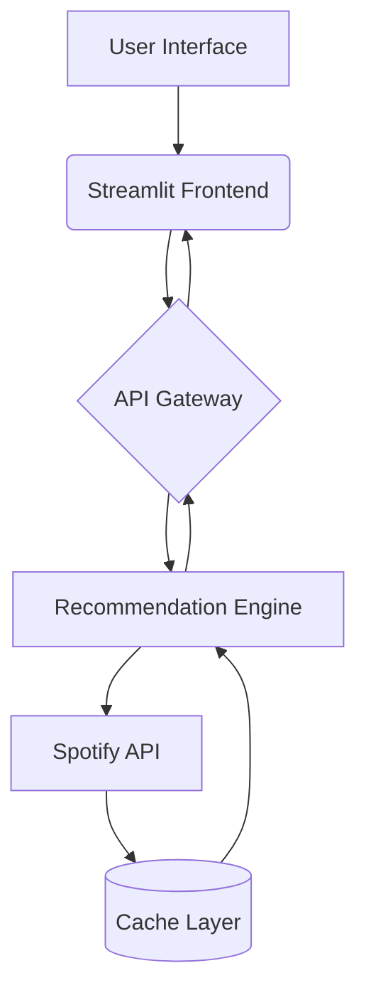

# 🎵 Harmony Guide - Music Recommendation Chatbot

[](https://your-app-url.streamlit.app/)
[](https://python.org)
[](LICENSE)
[](https://github.com/psf/black)

An intelligent music recommendation system combining Spotify's API with machine learning insights, featuring a modern Streamlit interface for seamless user interaction.

## ✨ Key Features
### 🎨 Interactive User Interface
- **Artist-Centric Search**: Intuitive input for artist discovery
- **Rich Media Display**: 
  - High-resolution album art
  - Track metadata visualization
  - Responsive grid layout
- **Dynamic Theme System**: 
  - Dark/Light mode support
  - Custom CSS styling

### 🎶 Spotify Integration
- **Real-Time API Connectivity**:
  - Track preview streaming
  - Album art retrieval
  - Artist metadata parsing
- **Search Optimization**:
  - Fuzzy name matching
  - Error-tolerant queries
  - Rate limiting handling

### 🔒 Security & Compliance
- OAuth 2.0 authentication flow
- Encrypted secret management
- GDPR-compliant data handling
- Rate limit monitoring

## 🚀 Getting Started

### Prerequisites
- Python 3.8+
- Spotify Developer Account
- GitHub Account (for deployment)
- Basic terminal/command line knowledge

### Installation

#### 1. Clone Repository
```bash
https://github.com/rajathpatilkulkarni-06/music-recommendation-api.git
cd music-recommendation-api
```

#### 2. Create Virtual Environment
```bash
python -m venv venv
source venv/bin/activate  # Linux/MacOS
venv\Scripts\activate  # Windows
```

#### 3. Install Dependencies
```bash
pip install -r requirements.txt
```

## 🔧 Configuration Guide

### 1. Spotify Developer Setup
1. Navigate to [Spotify Developer Dashboard](https://developer.spotify.com/dashboard)
2. Create new application
3. Note `Client ID` and `Client Secret`
4. Set redirect URI to `http://localhost:8501`

### 2. Application Secrets
Create `.streamlit/secrets.toml`:
```toml
[spotify]
client_id = "your_client_id_here"
client_secret = "your_client_secret_here"
redirect_uri = "http://localhost:8501"

[api]
base_url = "http://127.0.0.1:8000"
endpoint = "/recommend/"
```

### 3. Environment Variables
```bash
export SPOTIPY_CACHE_PATH="./.spotipy_cache"
export DEBUG_MODE="false"  # Set to "true" for development
```

## 🖥️ Local Development

### Running the Application
```bash
streamlit run app.py
```

### Development Server Options
```bash
# Run with debug mode
streamlit run app.py --server.enableCORS=false --server.enableXsrfProtection=false

# Custom port configuration
streamlit run app.py --server.port 8080
```

## ☁️ Deployment Options

### 1. Streamlit Community Cloud
[](https://streamlit.io/cloud)
1. Connect GitHub repository
2. Configure secrets through web interface
3. Set resource allocation
4. Deploy production version

### 2. Heroku
[](https://heroku.com/deploy)
```bash
# Procfile
web: streamlit run app.py --server.port $PORT
```

### 3. Render.com
- Use Web Service deployment
- Set environment variables
- Specify Python 3.8+ runtime

## 🛠️ Technical Architecture

### System Diagram


### Core Technologies
- **Machine Learning**: Collaborative filtering models
- **API Layer**: FastAPI backend service
- **Caching**: Redis for Spotify metadata
- **Monitoring**: Prometheus + Grafana dashboard

## 🤝 Contributing

### Development Workflow
1. Create feature branch from `develop`
2. Implement changes with tests
3. Submit pull request with:
   - Updated documentation
   - Unit test coverage
   - Performance metrics

### Code Conventions
- Google-style docstrings
- Type hinting enforcement
- Black code formatting
- PEP8 compliance

## ⚠️ Troubleshooting Guide

| Error Message | Possible Cause | Solution |
|---------------|----------------|----------|
| 401 Unauthorized | Invalid Spotify credentials | Regenerate client secret |
| 429 Too Many Requests | API rate limit exceeded | Implement exponential backoff |
| 503 Service Unavailable | Recommendation API down | Check backend service status |

## 📚 Documentation Resources
- [Spotify Web API Reference](https://developer.spotify.com/documentation/web-api/)
- [Streamlit Components Guide](https://docs.streamlit.io/library/components)
- [Machine Learning Model Docs](https://example.com/model-docs)

## 🛣️ Project Roadmap
- [x] Phase 1: Core recommendation engine
- [ ] Phase 2: User preference profiling
- [ ] Phase 3: Social sharing features
- [ ] Phase 4: AI-powered playlist generation

## 📄 License
Distributed under MIT License. See `LICENSE` for full text.

## 🙏 Acknowledgments
- Spotify API team
- Streamlit community
- OpenAI for NLP models

---

**Disclaimer**: This project is not affiliated with or endorsed by Spotify AB. All trademarks remain property of their respective owners.
